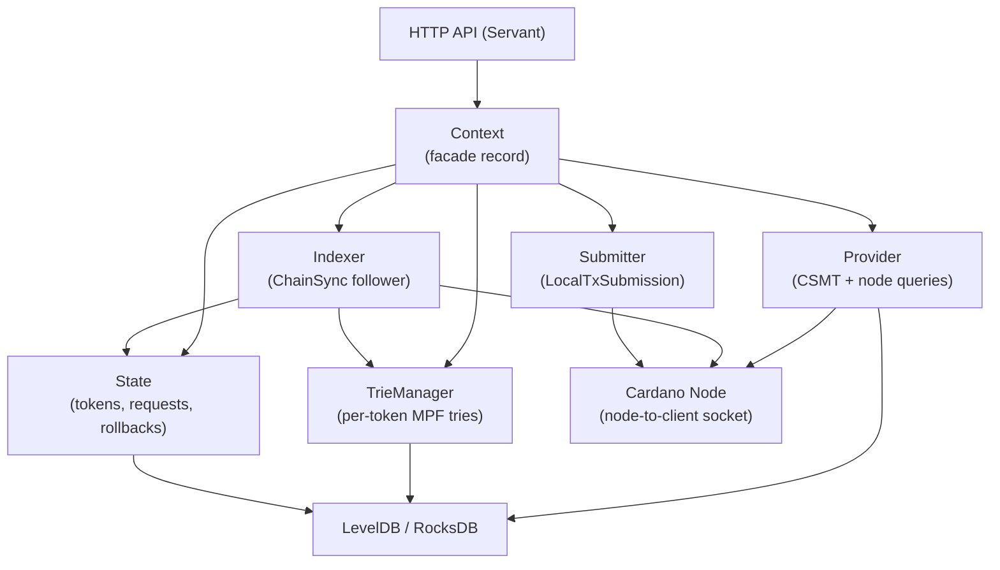
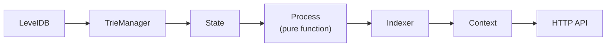
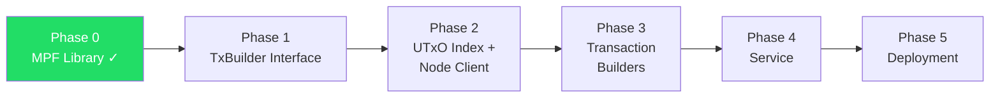

# PLAN: Haskell MPFS Service

## Goal

Rewrite the MPFS (Merkle Patricia Forestry Service) in Haskell,
replacing the TypeScript off-chain implementation while keeping the
Aiken on-chain validators unchanged.

## Design Principles

**No typeclasses.** This is a closed world — we use explicit records
of functions (dictionaries), polymorphic in the monad. Pass them
around explicitly. Never use typeclasses for abstraction.

This keeps the dependency graph visible, makes testing trivial
(swap the record), and avoids orphan instances and implicit
resolution surprises.

## Architecture

```mermaid
block-beta
    columns 1
    block:http["haskell-mpfs — HTTP service (Servant)"]
    end
    block:mpf["MPF trie (haskell-mpf) ✓ DONE\nProofs, insertion, deletion"]
    end
    block:txb["Transaction building interface\nCoin selection, fee estimation\n(record of functions)"]
    end
    block:csmt["cardano-utxo-csmt (embedded)\nUTxO queries via address prefix\nMithril bootstrap, ChainSync\n(replaces Yaci Store)"]
    end
    block:node["Node client (node-to-client)\nLocal state query + tx submission"]
    end

    http --> mpf --> txb --> csmt --> node
```

### Infrastructure decisions

**No Yaci Store, no Ogmios.** The only external dependency is
a Cardano node. Everything else is embedded.

**Why this works:** cardano-utxo-csmt already connects to the
node for ChainSync. The node exposes three mini-protocols on
its local Unix socket (node-to-client):

1. **ChainSync** — follow the chain block by block (csmt has this)
2. **LocalStateQuery** — query ledger state (protocol parameters)
3. **LocalTxSubmission** — submit signed transactions

All three share a single multiplexed connection to the node
socket. No extra processes, no WebSocket wrappers.

**What we get from each:**

| Need | Source | Why |
|------|--------|-----|
| Full UTxO set | csmt ChainSync + Mithril bootstrap | Already done |
| UTxOs by address | csmt prefix scan (re-keyed) | Key = `addr ++ txId ++ txIx` |
| Protocol params | LocalStateQuery | Fee coefficients, max tx size, min UTxO, collateral %, execution prices. Cached per epoch (~5 days) |
| Tx evaluation | LocalStateQuery | Execution unit estimation for Plutus scripts |
| Tx submission | LocalTxSubmission | Submit signed CBOR to the node mempool |
| Chain tip | csmt ChainSync | Already tracked |
| Block/tx info | csmt RocksDB | Stored during ChainSync processing |

**Runtime stack:** Cardano node only.

## TypeScript Singleton Map

The existing TypeScript service (`mpfs/off_chain/`) is built around
6 singletons — records of async functions, created once at startup
and passed around explicitly. This is the architecture we replicate
in Haskell (replacing `Promise<T>` with `m a`).

### Dependency graph



### The 6 singletons

**1. Provider** — blockchain queries (read-only)

UTxO lookups via cardano-utxo-csmt (address prefix scan on
the embedded CSMT). Protocol parameters and tx evaluation
via node-to-client local-state-query.

```
Provider m = Provider
  { fetchUtxos         :: Address -> m [UTxO]  -- CSMT prefix scan
  , fetchProtocolParams :: m ProtocolParams     -- node local-state-query
  , evaluateTx         :: TxCBOR -> m ExUnits   -- node local-state-query
  }
```

**2. TrieManager** — per-token MPF trie storage

Manages a map of token-id to MPF trie, backed by LevelDB
sublevels. Mutex-locked access. Supports hide/unhide for
rollback handling.

```
TrieManager m = TrieManager
  { withTrie :: TokenId -> (SafeTrie m -> m a) -> m a
  , trieIds  :: m [TokenId]
  , hide     :: TokenId -> m ()
  , unhide   :: TokenId -> m ()
  , delete   :: TokenId -> m ()
  }
```

**3. State** — chain-derived state (tokens, requests, rollbacks)

Tracks known tokens, pending requests, checkpoints, and
rollback journal. All in LevelDB sublevels. Mutex-locked.

```
State m = State
  { addToken      :: Slotted Token -> m ()
  , removeToken   :: Slotted TokenId -> m ()
  , updateToken   :: Slotted TokenChange -> m ()
  , addRequest    :: Slotted Request -> m ()
  , removeRequest :: Slotted OutputRef -> m ()
  , rollback      :: WithOrigin Slot -> m ()
  , tokens        :: Tokens m
  , requests      :: Requests m
  , checkpoints   :: Checkpoints m
  }
```

**4. Indexer** — ChainSync follower (via csmt)

Node-to-client ChainSync, reusing the csmt connection.
Follows the chain block by block, calling a Process
function for each transaction. Pausable via mutex (paused
during tx building to avoid state races).

```
Indexer m = Indexer
  { tips       :: m (NetworkTip, IndexerTip)
  , waitBlocks :: Int -> m BlockHeight
  , pause      :: m (m ())   -- returns release action
  }
```

**5. Submitter** — node-to-client tx submission

Uses LocalTxSubmission mini-protocol on the same node
socket. No extra connections or processes.

```
Submitter m = Submitter
  { submitTx :: TxCBOR -> m TxHash
  }
```

**6. Context** — facade record

Bundles all singletons into one record passed to transaction
builders and HTTP handlers. This is the main "environment"
threaded through the application.

```
Context m = Context
  { cagingScript  :: CagingScript
  , signingWallet :: Maybe (SigningWallet m)
  , addressWallet :: Address -> m WalletInfo
  , newTxBuilder  :: m (TxBuilder m)
  , fetchTokens   :: m [Token]
  , fetchToken    :: TokenId -> m (Maybe Token)
  , fetchRequests :: Maybe TokenId -> m [Request]
  , evaluateTx    :: TxCBOR -> m ExUnits
  , withTrie      :: TokenId -> (SafeTrie m -> m a) -> m a
  , waitBlocks    :: Int -> m BlockHeight
  , tips          :: m (NetworkTip, IndexerTip)
  , waitSettlement :: TxHash -> m BlockHash
  , facts         :: TokenId -> m (Map Key Value)
  , pauseIndexer  :: m (m ())
  , submitTx      :: TxCBOR -> m TxHash
  }
```

### Creation order

Singletons are created bottom-up and torn down top-down
(bracket pattern / `withX` nesting):



Each layer is created with a `withX` bracket that guarantees
cleanup (close connections, flush DB) on exit.

## Components

### 1. MPF Library ✓ DONE

Repository: `paolino/haskell-mpf` (this repo, to be renamed haskell-mpfs)

- 16-ary Merkle Patricia Forestry
- Blake2b-256, Aiken-compatible
- Proofs, insertion, deletion
- Pure + RocksDB backends

### 2. Transaction Building Interface

**Goal:** Define a pluggable interface (record of functions) for
transaction building. The backend implementation is deferred —
could be extracted from cardano-wallet, or a lightweight custom
implementation.

**Interface covers:**
- Coin selection: pick inputs to cover outputs + fees
- Fee estimation: compute fees for a given transaction body
- Balancing: adjust a partial transaction to be valid
  (inputs ≥ outputs + fees, correct change outputs)

**Shape** (sketch):

```haskell
data TxBuilder m = TxBuilder
  { balanceTx
      :: PartialTx -> UTxOSet -> ProtocolParams -> m BalancedTx
  , estimateFee
      :: TxBody -> ProtocolParams -> m Coin
  , selectCoins
      :: CoinSelectionGoal -> UTxOSet -> m CoinSelection
  }
```

No typeclasses — pass `TxBuilder m` explicitly.

**Possible backends (decided later):**
- Extracted `cardano-balance-tx` from cardano-wallet
- Lightweight custom implementation (our transactions are simple)
- Mock backend for testing

### 3. UTxO Index (cardano-utxo-csmt)

**Replaces Yaci Store entirely.** We embed cardano-utxo-csmt as a
library dependency. It provides:

- Full UTxO set via Mithril bootstrap + ChainSync
- RocksDB-backed CSMT with rollback support
- Merkle inclusion proofs for any UTxO

**Required change:** re-key the CSMT to `address ++ txId ++ txIx`
so that `seekKey(addressPrefix)` + cursor iteration gives all
UTxOs at an address. This is a change in `UTxOs.hs` key encoding,
not in the CSMT library itself.

**Node-to-client mini-protocols** (no Ogmios needed):
- `LocalStateQuery` — protocol parameters (cached per epoch),
  tx evaluation (execution units for Plutus scripts)
- `LocalTxSubmission` — submit signed transactions
- These share the same multiplexed socket connection that csmt
  already opens for ChainSync

### 4. Service Layer

**Mirrors the TypeScript service:**
- HTTP API (GET/POST) for facts, proofs
- Swagger/OpenAPI docs
- Chain indexer watches for MPF-related transactions
- Submitter with retry logic

**From the TypeScript codebase (`mpfs/off_chain/`):**
- `service/signingless/` — HTTP endpoints
- `indexer/` — chain event watching via Ogmios
- `transactions/` — boot, request, update, retract tx builders
- `submitter.ts` — submission + retry

## Phases



### Phase 0 — MPF Library ✓
Extract MPF from haskell-csmt. Done.

### Phase 1 — Transaction Building Interface
- Define `TxBuilder m` record of functions
- Define domain types (PartialTx, UTxOSet, ProtocolParams, etc.)
- Mock backend for testing
- Actual backend implementation deferred to Phase 3

### Phase 2 — UTxO Index + Node Client
- Embed cardano-utxo-csmt as library (Mithril + ChainSync)
- Add address-prefixed key encoding for UTxO-by-address queries
- Add LocalStateQuery for protocol params + tx evaluation
- Add LocalTxSubmission for tx submission
- All on the same node socket (no Ogmios)

### Phase 3 — Transaction Builders
- Boot transaction (create new MPF instance)
- Update transaction (insert/delete facts with proofs)
- Retract transaction
- End transaction
- Wire up balanceTx + signing

### Phase 4 — Service
- HTTP API matching TypeScript interface
- Indexer for chain events
- RocksDB-backed MPF trie state
- Submitter with retry

### Phase 5 — Deployment
- Docker image via Nix
- Deploy to plutimus.com alongside existing TypeScript service
- Integration tests with Yaci devkit or local testnet

## Open Questions

1. **TxBuilder backend** — extract cardano-balance-tx from wallet
   (proven but heavyweight) or write a lightweight custom
   implementation (our transactions are simple)?
2. **Signing** — use cardano-api signing or keep keys external
   (signingless mode)?
3. ~~**Indexer**~~ DECIDED — embed cardano-utxo-csmt, no Yaci,
   no Ogmios. All node communication via node-to-client socket.
4. **Multi-oracle** — the TypeScript version supports multiple
   oracles. Same for Haskell?
