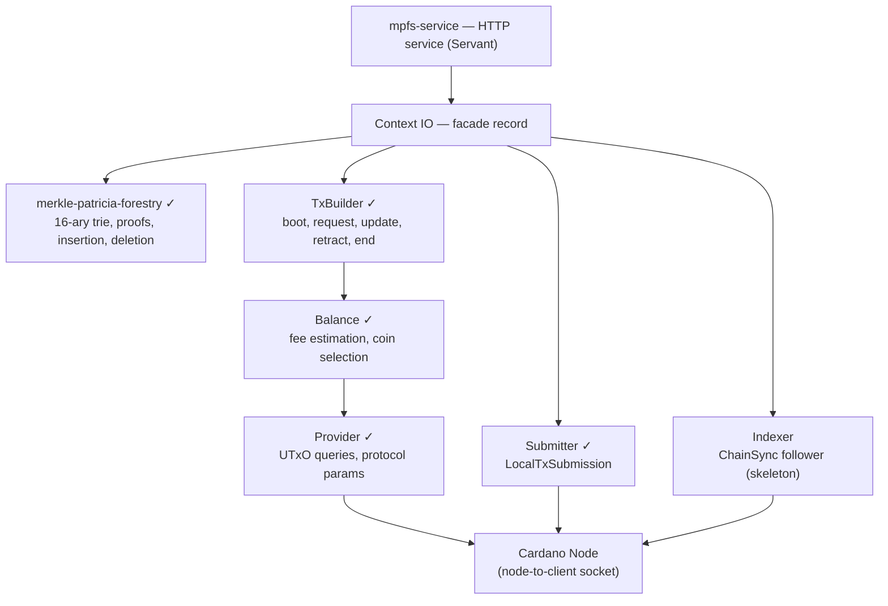
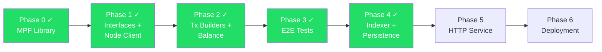

# PLAN: Haskell MPFS Service

## Goal

Rewrite the MPFS (Merkle Patricia Forestry Service) in Haskell,
replacing the TypeScript off-chain implementation while keeping the
Aiken on-chain validators unchanged.

## Design Principles

**No typeclasses.** This is a closed world — we use explicit records
of functions (dictionaries), polymorphic in the monad. Pass them
around explicitly. Never use typeclasses for abstraction.

This keeps the dependency graph visible, makes testing trivial
(swap the record), and avoids orphan instances and implicit
resolution surprises.

## Architecture



### Infrastructure decisions

**No Yaci Store, no Ogmios.** The only external dependency is
a Cardano node. Everything else is embedded.

Node-to-client mini-protocols on the local Unix socket:

1. **LocalStateQuery** — UTxO queries by address, protocol
   parameters (cached per epoch)
2. **LocalTxSubmission** — submit signed transactions
3. **ChainSync** — follow the chain block by block (indexer)

All three share a single multiplexed connection.

## Packages

### 1. `merkle-patricia-forestry` — core data structure ✓

- 16-ary hex-based Patricia trie with Blake2b-256 hashing
- Insertion, deletion, cryptographic inclusion proofs
- Aiken-compatible CBOR proof serialization
- Pure + RocksDB backends
- Property tests + cross-validation

### 2. `cardano-mpfs-offchain` — Cardano integration ✓

41 library modules, 12 unit test modules, 5 E2E test modules.

## Interfaces (record of functions)

### Context — facade

```haskell
Context m = Context
    { provider    :: Provider m
    , trieManager :: TrieManager m
    , state       :: State m
    , indexer     :: Indexer m
    , submitter   :: Submitter m
    , txBuilder   :: TxBuilder m
    }
```

### Provider — blockchain queries ✓

```haskell
Provider m = Provider
    { queryUTxOs        :: Addr -> m [(TxIn, TxOut ConwayEra)]
    , queryProtocolParams :: m (PParams ConwayEra)
    , evaluateTx        :: ByteString -> m ExUnits
    }
```

Real implementation: `Provider.NodeClient` — N2C
LocalStateQuery.

### Submitter — tx submission ✓

```haskell
newtype Submitter m = Submitter
    { submitTx :: Tx ConwayEra -> m SubmitResult
    }

data SubmitResult = Submitted TxId | Rejected ByteString
```

Real implementation: `Submitter.N2C` — N2C
LocalTxSubmission.

### TxBuilder — cage protocol transactions ✓

```haskell
TxBuilder m = TxBuilder
    { bootToken     :: Addr -> m (Tx ConwayEra)
    , requestInsert :: TokenId -> ByteString -> ByteString
                    -> Addr -> m (Tx ConwayEra)
    , requestDelete :: TokenId -> ByteString
                    -> Addr -> m (Tx ConwayEra)
    , updateToken   :: TokenId -> Addr -> m (Tx ConwayEra)
    , retractRequest :: TxIn -> Addr -> m (Tx ConwayEra)
    , endToken      :: TokenId -> Addr -> m (Tx ConwayEra)
    }
```

Real implementation: `TxBuilder.Real.*` — builds Conway-era
transactions with PlutusV3 scripts, inline datums, validity
intervals.

Sub-modules: `Boot`, `Request`, `Update`, `Retract`,
`Internal` (shared helpers, slot conversion, balance).

### State — chain-derived state ✓

```haskell
State m = State
    { tokens      :: Tokens m
    , requests    :: Requests m
    , checkpoints :: Checkpoints m
    }

Tokens m = Tokens
    { getToken, putToken, removeToken, listTokens }

Requests m = Requests
    { getRequest, putRequest, removeRequest
    , requestsByToken }

Checkpoints m = Checkpoints
    { getCheckpoint, putCheckpoint }
```

Implementation: `Mock.State` (IORef-backed) for testing.
`Indexer.Persistent` (RocksDB) for production.

### TrieManager — per-token MPF tries ✓

```haskell
TrieManager m = TrieManager
    { withTrie    :: TokenId -> (Trie m -> m a) -> m a
    , createTrie  :: TokenId -> m ()
    , deleteTrie  :: TokenId -> m ()
    }

Trie m = Trie
    { insert, delete, lookup, getRoot
    , getProof, getProofSteps }
```

Implementation: `Trie.PureManager` (in-memory) for testing.
`Trie.Persistent` (RocksDB with token-prefixed keys) for
production.

### Indexer — chain follower

```haskell
Indexer m = Indexer
    { start, stop, pause, resume
    , getTip :: m ChainTip
    }
```

Implementation: `Indexer.Skeleton` (lifecycle only).
`Indexer.CageFollower` (block processing, event detection,
trie mutations, rollback via inverse operations).

## Key domain types

```haskell
newtype TokenId = TokenId AssetName
newtype Root    = Root ByteString
newtype BlockId = BlockId ByteString

data Request = Request
    { requestToken, requestOwner, requestKey
    , requestValue :: Operation
    , requestFee, requestSubmittedAt }

data TokenState = TokenState
    { owner, root, maxFee
    , processTime, retractTime }

data CageConfig = CageConfig
    { cageScriptBytes, cfgScriptHash
    , defaultProcessTime, defaultRetractTime
    , defaultMaxFee, network
    , systemStartPosixMs, slotLengthMs }
```

## The cage protocol

Four operations, each a Plutus-validated transaction:

| Step | Redeemer | What happens |
|------|----------|-------------|
| **Boot** | Mint | Mint cage token, create state UTxO with empty root |
| **Request** | Contribute | Submit key/value request as separate UTxO |
| **Update** | Modify | Consume requests, update trie root in state datum |
| **Retract** | Contribute | Cancel pending request (Phase 2 window only) |

Time phases (relative to request's `submittedAt`):
- **Phase 1**: `[0, processTime)` — requests accepted
- **Phase 2**: `[processTime, processTime + retractTime)` — retract allowed
- **Phase 3**: `[processTime + retractTime, ∞)` — update forced

Slot conversion: ceiling division for lower bounds
(`posixMsCeilSlot`), floor division for upper bounds
(`posixMsToSlot`), minus 1 for strict `entirely_before`.

## Application wiring

`Application.withApplication` creates the full `Context IO`:

1. Open N2C multiplexed connection to the node socket
2. Start LSQ + TxSubmission mini-protocol threads
3. Wire `Provider.NodeClient` (LSQ queries)
4. Wire `Submitter.N2C` (tx submission)
5. Wire `TxBuilder.Real` (PlutusV3 cage transactions)
6. Create `Mock.State` + `Trie.PureManager`
7. Create `Mock.Indexer` (no-op)
8. Bundle into `Context IO`

## Tests

| Suite | What | Status |
|-------|------|--------|
| **MPF unit-tests** | Trie ops, proof serialization, backends | ✓ |
| **Offchain unit-tests** | Balance, OnChain, Proof, State, Trie, TxBuilder | ✓ |
| **E2E ProviderSpec** | LSQ queries against devnet node | ✓ |
| **E2E SubmitterSpec** | ADA transfer via N2C | ✓ |
| **E2E CageSpec** | Full boot → request → update → retract | ✓ |

E2E tests start a local `cardano-node` (devnet, ~0.1s slots),
load the real PlutusV3 cage script from the Aiken blueprint
(`MPFS_BLUEPRINT` env var), and exercise real Plutus evaluation.

Aiken simulate is optionally run before submission for
debugging (requires `aiken` in PATH).

## CI (GitHub Actions)

```
build:  nix build unit-tests + offchain-tests
        fourmolu check, cabal-fmt check, hlint
e2e:    nix build e2e-tests
        nix develop -c ./result/bin/e2e-tests
        (cardano-node + aiken in nix shell)
```

## Phases



### Phase 0 — MPF Library ✓

- `merkle-patricia-forestry` package
- Pure + RocksDB backends, 16-ary hex trie, Blake2b-256
- Aiken-compatible CBOR proof serialization
- Property tests + cross-validation

### Phase 1 — Interfaces + Node Client ✓

- Record-of-functions interfaces (`Context`, `Provider`,
  `Submitter`, `TxBuilder`, `State`, `Trie`, `Indexer`)
- Mock implementations for all interfaces
- N2C multiplexed connection (`NodeClient.Connection`)
- LocalStateQuery client (`NodeClient.LocalStateQuery`)
- LocalTxSubmission client (`NodeClient.LocalTxSubmission`)
- Real `Provider.NodeClient` (UTxO queries, protocol params)
- Real `Submitter.N2C` (tx submission)
- CIP-57 blueprint loading (`Blueprint`)
- `Application` wiring module

### Phase 2 — Transaction Builders + Balance ✓

- On-chain type integration (`OnChain` — datums, redeemers,
  policy ID, cage address, PlutusV3 script)
- `TxBuilder.Real.Boot` — mint cage token
- `TxBuilder.Real.Request` — submit insert/delete request
- `TxBuilder.Real.Update` — consume requests, update root
- `TxBuilder.Real.Retract` — cancel pending request
- `TxBuilder.Real.Internal` — shared helpers, POSIX-to-slot
  conversion (floor + ceiling), ExUnits estimation
- `Balance` — fee estimation fixpoint, coin selection
- `Proof` — MPF proof to on-chain ProofStep conversion
- Unit tests for all tx builders (mock context)

### Phase 3 — E2E Tests ✓

- Devnet infrastructure (`Devnet.hs` — start/stop
  `cardano-node` subprocess, genesis patching)
- Test setup (`Setup.hs` — genesis signing key, addresses)
- Provider E2E (`ProviderSpec` — LSQ queries)
- Submitter E2E (`SubmitterSpec` — ADA transfer)
- Full cage flow E2E (`CageSpec` — boot → request →
  update → retract with real Plutus evaluation)
- Optional aiken simulate integration
- CI job running E2E on GitHub Actions

### Phase 4 — Indexer + Persistence ✓

- `AllColumns` GADT with cage + trie column families
- CBOR codecs for all column key-value types
- Persistent `State` backend (`Indexer.Persistent`)
- Persistent `TrieManager` backend (`Trie.Persistent`)
  with token-prefixed keys for per-token isolation
- Cage event detection from transactions
  (`Indexer.CageEvent.detectCageEvents`)
- Block processor (`Indexer.CageFollower`) with event
  application, trie mutations, and inverse operations
  for rollback
- Application wiring with shared RocksDB instance
- 197 unit tests (14 CageFollower, 27 persistent trie)

### Phase 5 — HTTP Service

- Servant HTTP API matching TypeScript interface
- Endpoints: facts, proofs, tokens, requests
- Swagger/OpenAPI documentation
- Submitter with retry logic

### Phase 6 — Deployment

- Docker image via Nix
- Deploy to plutimus.com
- Integration with production Cardano node

## Open Questions

1. **Persistent backend** — RocksDB (already have MPF backend)
   or LevelDB (lighter) for State + TrieManager?
2. **Signing** — keep signingless mode (external signing) or
   add embedded key management?
3. **Multi-oracle** — the TypeScript version supports multiple
   oracles. Same for Haskell?
4. **UTxO index** — use cardano-utxo-csmt for full UTxO set
   (needed for general coin selection) or keep relying on
   LSQ address queries (sufficient for cage protocol)?
