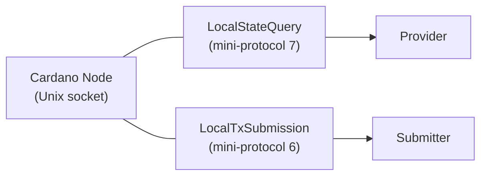
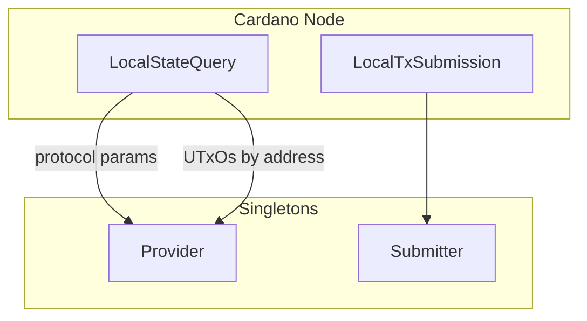

# Data Sources

All external data enters the system through a single Cardano node
connection. There is **no Ogmios, no Yaci Store** — only a
node-to-client (N2C) Unix socket carrying multiplexed mini-protocols.

## Connection

Both mini-protocols share the same multiplexed socket via
`ouroboros-network`. The connection is established by
`runNodeClient` and runs in a background thread.

## Data Flow

## N2C Mini-Protocols

### LocalStateQuery (protocol 7)

Queries the current ledger state. Used for two purposes:

1. **Protocol parameters** — fee coefficients, max transaction size,
   minimum UTxO value, collateral percentage, Plutus execution prices.
   Queried via `GetCurrentPParams` (Conway era).

2. **UTxO queries** — look up UTxOs at a given address via
   `GetUTxOByAddress`. Used for coin selection and locating
   script inputs.

The Provider acquires the tip on each query — no long-lived
acquired state.

### LocalTxSubmission (protocol 6)

Submits a signed `Tx ConwayEra` to the node's mempool. The
Submitter converts the ledger transaction to a consensus `GenTx`
and returns either `Submitted txId` or `Rejected reason`.

## Channel Architecture

Communication between the N2C connection thread and the Provider /
Submitter uses `TBQueue`-backed channels:

- **`LSQChannel`** — carries `(query, resultVar)` pairs. The
  Provider writes a query and blocks on the result MVar.
- **`LTxSChannel`** — carries `(genTx, resultVar)` pairs. The
  Submitter writes a transaction and blocks on the result MVar.

The N2C client thread reads from these queues and drives the
protocol state machines.

## Future: ChainSync

ChainSync (mini-protocol 5) is not yet wired. When implemented,
it will feed blocks to the Indexer for processing token events,
request tracking, and trie updates. The current skeleton indexer
returns a genesis tip placeholder.
