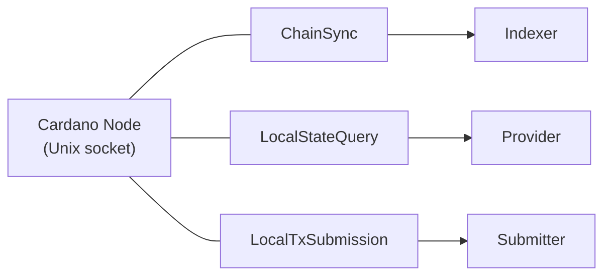
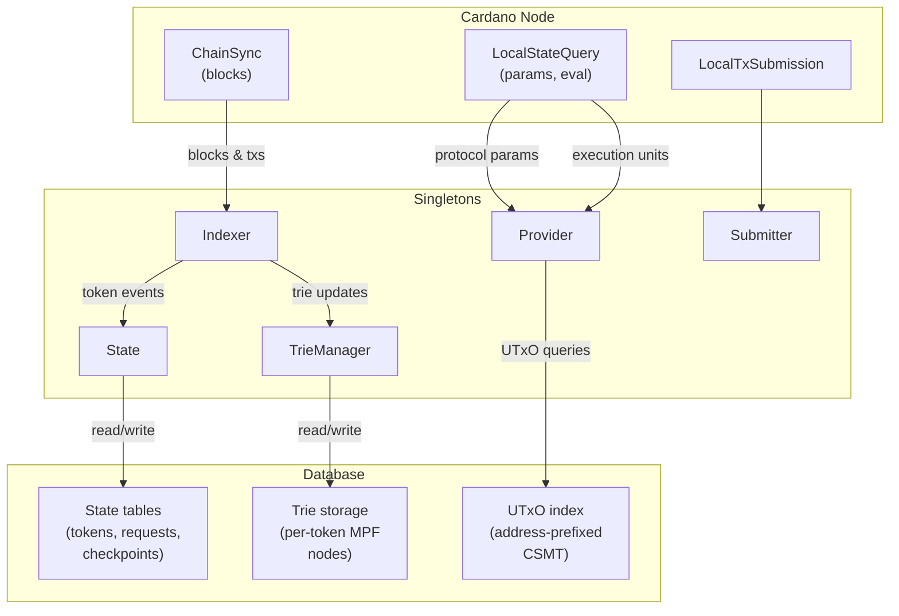

# Data Sources

All external data enters the system through a single Cardano node
connection. There is **no Ogmios, no Yaci Store** — only a
node-to-client Unix socket carrying multiplexed mini-protocols.

## Connections

All three mini-protocols share the same multiplexed socket.

## Data Sources Table

| Data | Source | Protocol | Consumer | Why |
|------|--------|----------|----------|-----|
| Blocks / transactions | Cardano Node | ChainSync | Indexer | Follow the chain to detect token creation, updates, requests, and rollbacks |
| UTxO set by address | `cardano-utxo-csmt` | Mithril bootstrap + ChainSync | Provider | Look up UTxOs for coin selection and script inputs. Key format: `address ++ txId ++ txIx` enables prefix scan by address |
| Protocol parameters | Cardano Node | LocalStateQuery | Provider | Fee coefficients, max tx size, min UTxO, collateral percentage, execution prices. Cached per epoch (~5 days) |
| Transaction evaluation | Cardano Node | LocalStateQuery | Provider | Estimate execution units for Plutus scripts before submission |
| Chain tip | `cardano-utxo-csmt` | ChainSync | Indexer | Track sync progress and settlement |
| Transaction submission | Cardano Node | LocalTxSubmission | Submitter | Submit signed CBOR transactions to the node mempool |

## Data Flow: Source to Singleton

## Node-to-Client Mini-Protocols

### ChainSync

Follows the chain block by block. The Indexer processes each
block's transactions through a pure `Process` function that
identifies relevant events:

- New token creation
- Token updates (fact insertion/deletion)
- New requests
- Rollbacks (rewind state to a previous slot)

`cardano-utxo-csmt` already implements ChainSync — the Indexer
reuses this connection.

### LocalStateQuery

Queries the current ledger state. Used for two purposes:

1. **Protocol parameters** — fee coefficients, max transaction size,
   minimum UTxO value, collateral percentage, Plutus execution prices.
   Cached per epoch (~5 days), so queries are infrequent.

2. **Transaction evaluation** — estimate execution units for Plutus
   scripts. Called during transaction building to compute fees
   accurately before signing.

### LocalTxSubmission

Submits a signed transaction (CBOR) to the node's mempool.
The Submitter singleton wraps this protocol.
