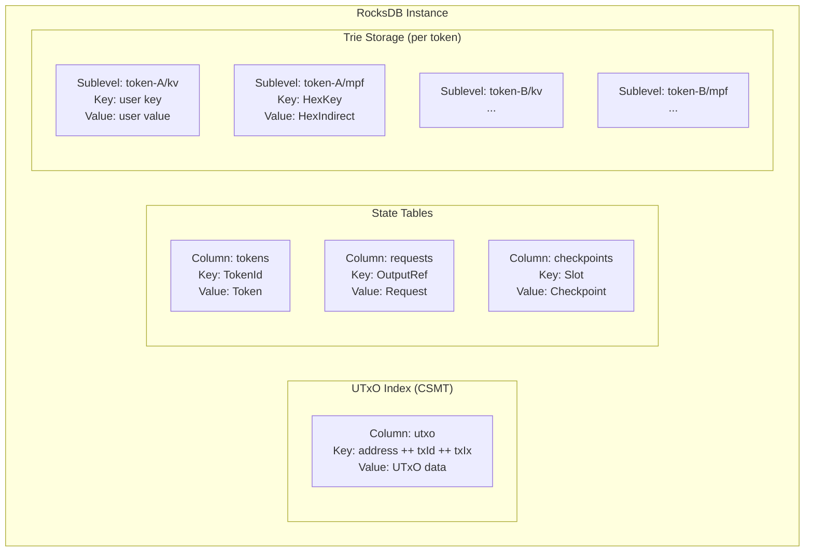
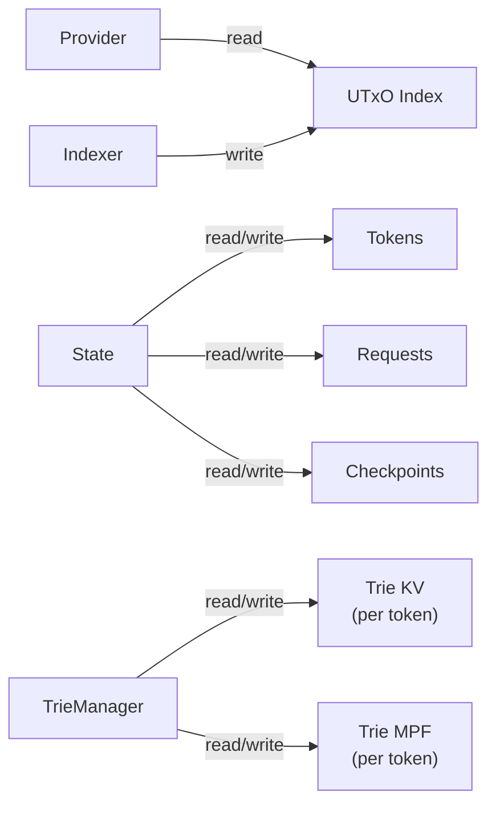

# Database Layer

All persistent state is stored in RocksDB, accessed through the
[rocksdb-kv-transactions](https://github.com/paolino/rocksdb-kv-transactions)
library which provides a type-safe, transactional key-value
abstraction.

## Storage Layout



## Who Reads and Writes What

| Storage Area | Singleton | Read | Write |
|---|---|---|---|
| UTxO index | Provider | Yes | — |
| UTxO index | Indexer (via CSMT) | — | Yes |
| Tokens | State | Yes | Yes |
| Requests | State | Yes | Yes |
| Checkpoints | State | Yes | Yes |
| Trie kv (per token) | TrieManager | Yes | Yes |
| Trie mpf (per token) | TrieManager | Yes | Yes |



## rocksdb-kv-transactions

The database abstraction is provided by
`rocksdb-kv-transactions`, a library that layers type-safe
transactions over RocksDB column families.

### Core Abstraction

```haskell
-- Type-safe column definition
data KV k v

-- A database with typed columns, selected by a GADT
data Database m cf t op = Database
    { valueAt :: cf -> ByteString -> m (Maybe ByteString)
    , applyOps :: [op] -> m ()
    , mkOperation :: cf -> ByteString -> Maybe ByteString -> op
    , newIterator :: cf -> m (QueryIterator m)
    , columns :: DMap t (Column cf)
    }
```

Columns are defined via a GADT selector. Each column carries
its own serialization codecs (Prism-based), so key/value
encoding is type-checked at compile time.

### Transactions

```haskell
-- Transactional operations
query  :: t c -> KeyOf c -> Transaction m cf t op (Maybe (ValueOf c))
insert :: t c -> KeyOf c -> ValueOf c -> Transaction m cf t op ()
delete :: t c -> KeyOf c -> Transaction m cf t op ()

-- Execution
runTransactionUnguarded :: Database m cf t op -> Transaction m cf t op b -> m b
```

Transactions buffer writes and commit atomically. For concurrent
access, `newRunTransaction` provides mutex-based serialization
via `MVar`.

### Cursors

Range queries use a cursor abstraction:

```haskell
firstEntry :: Cursor m c (Maybe (Entry c))
lastEntry  :: Cursor m c (Maybe (Entry c))
nextEntry  :: Cursor m c (Maybe (Entry c))
prevEntry  :: Cursor m c (Maybe (Entry c))
seekKey    :: KeyOf c -> Cursor m c (Maybe (Entry c))
```

This is how the Provider performs UTxO lookups by address:
`seekKey(addressPrefix)` followed by cursor iteration collects
all UTxOs at a given address.

## Key Encoding

### UTxO Index

The UTxO index re-keys the CSMT for address-based lookups:

```
key = address ++ txId ++ txIx
```

This enables efficient prefix scans: seek to an address prefix,
then iterate forward to collect all UTxOs belonging to that
address.

### Trie Storage

Each token's trie uses two column families within a sublevel:

- **kv** — raw user key-value pairs
- **mpf** — MPF trie nodes, keyed by `HexKey` (list of hex
  digits / nibbles), values are `HexIndirect` references
  containing the jump path, value hash, and leaf flag

### Serialization

Uses the `cereal` library:

- `HexKey`: Word16be length prefix + packed nibbles (2 per byte)
- `HexIndirect`: HexKey + sized ByteString + leaf flag (Word8)

## Lifecycle

The database is created first and destroyed last:

```
startup:  DB → TrieManager → State → Process → Indexer → Context → API
teardown: API → Context → Indexer → Process → State → TrieManager → DB
```

Each layer uses a bracket pattern (`withX`) ensuring cleanup
even on exceptions.
