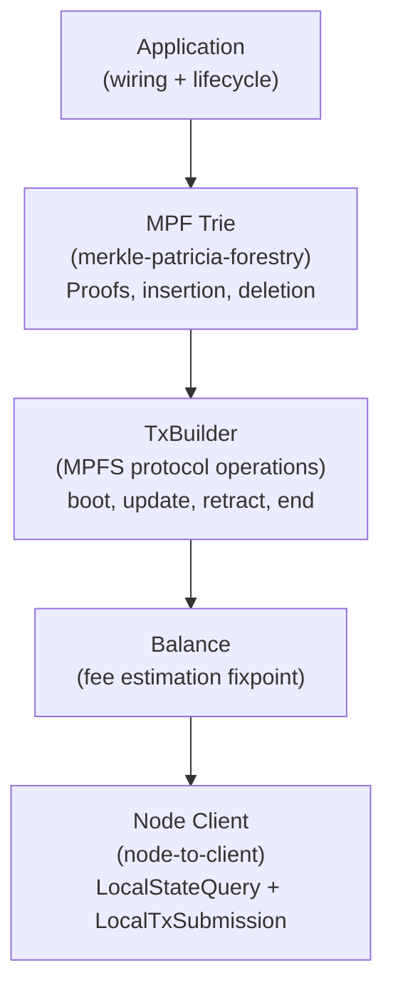
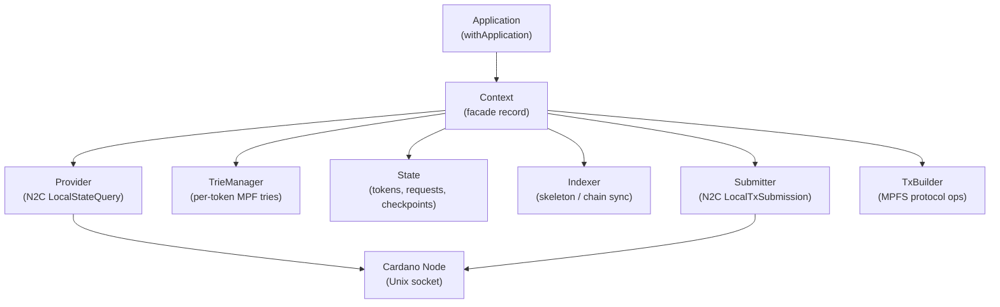
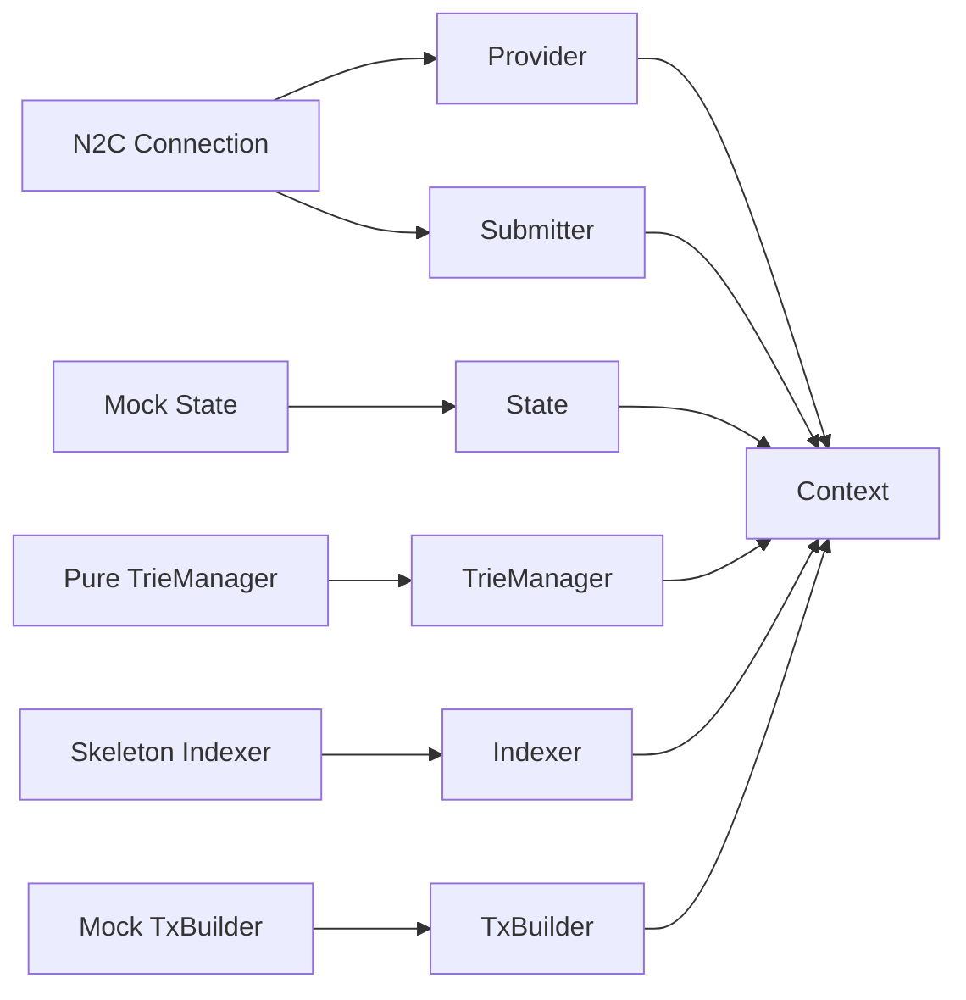
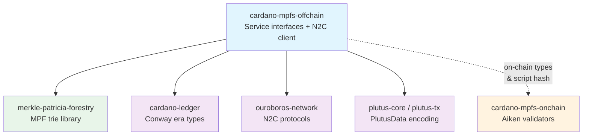
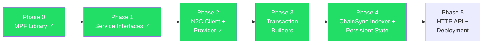

# Architecture Overview

## System Stack

The service connects to a Cardano node via a Unix socket carrying
multiplexed N2C mini-protocols. The `Provider` queries UTxOs and
protocol parameters via `LocalStateQuery`; the `Submitter` sends
signed transactions via `LocalTxSubmission`. The `TxBuilder`
constructs MPFS protocol transactions (boot, update, retract, end)
and `balanceTx` handles fee estimation through a fixpoint loop.

## Singleton Dependency Graph

Every major component is a **record of functions** (no typeclasses).
Records are created bottom-up and torn down top-down using bracket
patterns.

## Application Wiring

`withApplication` creates and wires all components:

The `Provider` and `Submitter` use real N2C connections. State,
TrieManager, and Indexer currently use mock/pure/skeleton
implementations.

## External Dependencies

| Color | Meaning |
|-------|---------|
| Blue | This project |
| Green | MPF trie library (same repo) |
| Orange | On-chain Aiken validators (separate repo) |
| Purple | Cardano ecosystem dependencies |

## Module Hierarchy

The `cardano-mpfs-offchain` library is organized in layers.
All modules live under `Cardano.MPFS`.

[search all modules]: https://github.com/paolino/cardano-mpfs-offchain/search?q=path%3Acardano-mpfs-offchain%2Flib+extension%3Ahs&type=code

### Core — domain types and pure logic

| Module | Purpose |
|--------|---------|
| [`Core.Types`][s-types] | `TokenId`, `Root`, `Request`, `TokenState`, `CageConfig` |
| [`Core.OnChain`][s-onchain] | Datum/redeemer encodings, `cagePolicyId`, `cageAddress`, PlutusV3 script |
| [`Core.Blueprint`][s-blueprint] | CIP-57 blueprint schema loading and validation |
| [`Core.Proof`][s-proof] | MPF proof to on-chain `ProofStep` conversion |
| [`Core.Balance`][s-balance] | `balanceTx` — fee estimation fixpoint loop |
| [`Core.Bootstrap`][s-bootstrap] | CBOR bootstrap file for UTxO seeding |

[s-types]: https://github.com/paolino/cardano-mpfs-offchain/search?q=%22module+Cardano.MPFS.Core.Types%22&type=code
[s-onchain]: https://github.com/paolino/cardano-mpfs-offchain/search?q=%22module+Cardano.MPFS.Core.OnChain%22&type=code
[s-blueprint]: https://github.com/paolino/cardano-mpfs-offchain/search?q=%22module+Cardano.MPFS.Core.Blueprint%22&type=code
[s-proof]: https://github.com/paolino/cardano-mpfs-offchain/search?q=%22module+Cardano.MPFS.Core.Proof%22&type=code
[s-balance]: https://github.com/paolino/cardano-mpfs-offchain/search?q=%22module+Cardano.MPFS.Core.Balance%22&type=code
[s-bootstrap]: https://github.com/paolino/cardano-mpfs-offchain/search?q=%22module+Cardano.MPFS.Core.Bootstrap%22&type=code

### Interfaces — record-of-functions singletons

| Module | Purpose |
|--------|---------|
| [`Context`][s-context] | Facade bundling all singletons |
| [`Provider`][s-provider] | `queryUTxOs`, `queryProtocolParams` |
| [`State`][s-state] | `Tokens`, `Requests`, `Checkpoints` sub-records |
| [`Trie`][s-trie] | `TrieManager` — per-token MPF trie access |
| [`TxBuilder`][s-txbuilder] | Cage protocol operations (boot, request, update, retract, end) |
| [`Indexer`][s-indexer] | Chain follower lifecycle (`start`, `stop`, `getTip`) |
| [`Submitter`][s-submitter] | `submitTx :: Tx ConwayEra -> m SubmitResult` |
| [`Application`][s-application] | `withApplication` — wiring and lifecycle |

[s-context]: https://github.com/paolino/cardano-mpfs-offchain/search?q=%22module+Cardano.MPFS.Context%22&type=code
[s-provider]: https://github.com/paolino/cardano-mpfs-offchain/search?q=%22module+Cardano.MPFS.Provider%22+path%3Alib%2FCardano%2FMPFS%2FProvider.hs&type=code
[s-state]: https://github.com/paolino/cardano-mpfs-offchain/search?q=%22module+Cardano.MPFS.State%22&type=code
[s-trie]: https://github.com/paolino/cardano-mpfs-offchain/search?q=%22module+Cardano.MPFS.Trie%22+path%3Alib%2FCardano%2FMPFS%2FTrie.hs&type=code
[s-txbuilder]: https://github.com/paolino/cardano-mpfs-offchain/search?q=%22module+Cardano.MPFS.TxBuilder%22+path%3Alib%2FCardano%2FMPFS%2FTxBuilder.hs&type=code
[s-indexer]: https://github.com/paolino/cardano-mpfs-offchain/search?q=%22module+Cardano.MPFS.Indexer%22+path%3Alib%2FCardano%2FMPFS%2FIndexer.hs&type=code
[s-submitter]: https://github.com/paolino/cardano-mpfs-offchain/search?q=%22module+Cardano.MPFS.Submitter%22+path%3Alib%2FCardano%2FMPFS%2FSubmitter.hs&type=code
[s-application]: https://github.com/paolino/cardano-mpfs-offchain/search?q=%22module+Cardano.MPFS.Application%22&type=code

### Indexer — chain sync and persistence

| Module | Purpose |
|--------|---------|
| [`Indexer.Event`][s-idx-event] | [`detectCageEvents`][s-detect] — cage tx classification |
| [`Indexer.Follower`][s-idx-follower] | Block processor: events, trie mutations, inverse ops |
| [`Indexer.Persistent`][s-idx-persist] | RocksDB-backed `State` |
| [`Indexer.Columns`][s-idx-columns] | [`AllColumns`][s-allcolumns] GADT — full DB schema |
| [`Indexer.Codecs`][s-idx-codecs] | CBOR serialization for column key-value types |
| [`Indexer.Rollback`][s-idx-rollback] | [`CageInverseOp`][s-inverseop] — undo operations |

[s-idx-event]: https://github.com/paolino/cardano-mpfs-offchain/search?q=%22module+Cardano.MPFS.Indexer.Event%22&type=code
[s-detect]: https://github.com/paolino/cardano-mpfs-offchain/search?q=detectCageEvents&type=code
[s-idx-follower]: https://github.com/paolino/cardano-mpfs-offchain/search?q=%22module+Cardano.MPFS.Indexer.Follower%22&type=code
[s-idx-persist]: https://github.com/paolino/cardano-mpfs-offchain/search?q=%22module+Cardano.MPFS.Indexer.Persistent%22&type=code
[s-idx-columns]: https://github.com/paolino/cardano-mpfs-offchain/search?q=%22module+Cardano.MPFS.Indexer.Columns%22&type=code
[s-allcolumns]: https://github.com/paolino/cardano-mpfs-offchain/search?q=%22data+AllColumns%22&type=code
[s-idx-codecs]: https://github.com/paolino/cardano-mpfs-offchain/search?q=%22module+Cardano.MPFS.Indexer.Codecs%22&type=code
[s-idx-rollback]: https://github.com/paolino/cardano-mpfs-offchain/search?q=%22module+Cardano.MPFS.Indexer.Rollback%22&type=code
[s-inverseop]: https://github.com/paolino/cardano-mpfs-offchain/search?q=%22data+CageInverseOp%22&type=code

### NodeClient — N2C protocol clients

| Module | Purpose |
|--------|---------|
| [`NodeClient.Connection`][s-nc-conn] | [`runNodeClient`][s-runnc] — multiplexed N2C connection |
| [`NodeClient.LocalStateQuery`][s-nc-lsq] | LSQ protocol client for UTxOs and PParams |
| [`NodeClient.LocalTxSubmission`][s-nc-ltxs] | Tx submission protocol client |
| [`NodeClient.Codecs`][s-nc-codecs] | N2C codec bundle |
| [`NodeClient.Types`][s-nc-types] | `LSQChannel`, `LTxSChannel` |

[s-nc-conn]: https://github.com/paolino/cardano-mpfs-offchain/search?q=%22module+Cardano.MPFS.NodeClient.Connection%22&type=code
[s-runnc]: https://github.com/paolino/cardano-mpfs-offchain/search?q=runNodeClient+path%3ANodeClient&type=code
[s-nc-lsq]: https://github.com/paolino/cardano-mpfs-offchain/search?q=%22module+Cardano.MPFS.NodeClient.LocalStateQuery%22&type=code
[s-nc-ltxs]: https://github.com/paolino/cardano-mpfs-offchain/search?q=%22module+Cardano.MPFS.NodeClient.LocalTxSubmission%22&type=code
[s-nc-codecs]: https://github.com/paolino/cardano-mpfs-offchain/search?q=%22module+Cardano.MPFS.NodeClient.Codecs%22&type=code
[s-nc-types]: https://github.com/paolino/cardano-mpfs-offchain/search?q=%22module+Cardano.MPFS.NodeClient.Types%22&type=code

### TxBuilder — cage protocol transactions

| Module | Purpose |
|--------|---------|
| [`TxBuilder.Config`][s-txb-cfg] | `CageConfig` loading |
| [`TxBuilder.Real`][s-txb-real] | [`mkRealTxBuilder`][s-mkrealtxb] entry point |
| [`TxBuilder.Real.Boot`][s-txb-boot] | Mint cage token |
| [`TxBuilder.Real.Request`][s-txb-req] | Submit insert/delete request |
| [`TxBuilder.Real.Update`][s-txb-upd] | Consume requests, update root |
| [`TxBuilder.Real.Retract`][s-txb-ret] | Cancel pending request |
| [`TxBuilder.Real.End`][s-txb-end] | Burn cage token |
| [`TxBuilder.Real.Internal`][s-txb-int] | Shared helpers, POSIX-to-slot conversion |

[s-txb-cfg]: https://github.com/paolino/cardano-mpfs-offchain/search?q=%22module+Cardano.MPFS.TxBuilder.Config%22&type=code
[s-txb-real]: https://github.com/paolino/cardano-mpfs-offchain/search?q=%22module+Cardano.MPFS.TxBuilder.Real%22+path%3AReal.hs&type=code
[s-mkrealtxb]: https://github.com/paolino/cardano-mpfs-offchain/search?q=mkRealTxBuilder&type=code
[s-txb-boot]: https://github.com/paolino/cardano-mpfs-offchain/search?q=%22module+Cardano.MPFS.TxBuilder.Real.Boot%22&type=code
[s-txb-req]: https://github.com/paolino/cardano-mpfs-offchain/search?q=%22module+Cardano.MPFS.TxBuilder.Real.Request%22&type=code
[s-txb-upd]: https://github.com/paolino/cardano-mpfs-offchain/search?q=%22module+Cardano.MPFS.TxBuilder.Real.Update%22&type=code
[s-txb-ret]: https://github.com/paolino/cardano-mpfs-offchain/search?q=%22module+Cardano.MPFS.TxBuilder.Real.Retract%22&type=code
[s-txb-end]: https://github.com/paolino/cardano-mpfs-offchain/search?q=%22module+Cardano.MPFS.TxBuilder.Real.End%22&type=code
[s-txb-int]: https://github.com/paolino/cardano-mpfs-offchain/search?q=%22module+Cardano.MPFS.TxBuilder.Real.Internal%22&type=code

### Trie — MPF backends

| Module | Purpose |
|--------|---------|
| [`Trie.Pure`][s-trie-pure] | `IORef`-backed in-memory trie |
| [`Trie.PureManager`][s-trie-pm] | [`mkPureTrieManager`][s-mkpuretm] — in-memory `TrieManager` |
| [`Trie.Persistent`][s-trie-pers] | [`mkPersistentTrieManager`][s-mkperstm] — RocksDB with token-prefixed keys |

[s-trie-pure]: https://github.com/paolino/cardano-mpfs-offchain/search?q=%22module+Cardano.MPFS.Trie.Pure%22&type=code
[s-trie-pm]: https://github.com/paolino/cardano-mpfs-offchain/search?q=%22module+Cardano.MPFS.Trie.PureManager%22&type=code
[s-mkpuretm]: https://github.com/paolino/cardano-mpfs-offchain/search?q=mkPureTrieManager&type=code
[s-trie-pers]: https://github.com/paolino/cardano-mpfs-offchain/search?q=%22module+Cardano.MPFS.Trie.Persistent%22&type=code
[s-mkperstm]: https://github.com/paolino/cardano-mpfs-offchain/search?q=mkPersistentTrieManager&type=code

### Mock — test doubles

| Module | Purpose |
|--------|---------|
| [`Mock.Context`][s-mock-ctx] | [`withMockContext`][s-withmock] — full mock wiring |
| [`Mock.Provider`][s-mock-prv] | In-memory UTxO store |
| [`Mock.State`][s-mock-st] | [`mkMockState`][s-mkmockst] — `IORef`-backed state |
| [`Mock.Submitter`][s-mock-sub] | Always-succeeds submitter |
| [`Mock.TxBuilder`][s-mock-txb] | [`mkMockTxBuilder`][s-mkmocktxb] — placeholder builder |
| [`Mock.Indexer`][s-mock-idx] | No-op indexer |
| [`Mock.Skeleton`][s-mock-skel] | [`mkSkeletonIndexer`][s-mkskel] — lifecycle-only skeleton |

[s-mock-ctx]: https://github.com/paolino/cardano-mpfs-offchain/search?q=%22module+Cardano.MPFS.Mock.Context%22&type=code
[s-withmock]: https://github.com/paolino/cardano-mpfs-offchain/search?q=withMockContext&type=code
[s-mock-prv]: https://github.com/paolino/cardano-mpfs-offchain/search?q=%22module+Cardano.MPFS.Mock.Provider%22&type=code
[s-mock-st]: https://github.com/paolino/cardano-mpfs-offchain/search?q=%22module+Cardano.MPFS.Mock.State%22&type=code
[s-mkmockst]: https://github.com/paolino/cardano-mpfs-offchain/search?q=mkMockState&type=code
[s-mock-sub]: https://github.com/paolino/cardano-mpfs-offchain/search?q=%22module+Cardano.MPFS.Mock.Submitter%22&type=code
[s-mock-txb]: https://github.com/paolino/cardano-mpfs-offchain/search?q=%22module+Cardano.MPFS.Mock.TxBuilder%22&type=code
[s-mkmocktxb]: https://github.com/paolino/cardano-mpfs-offchain/search?q=mkMockTxBuilder&type=code
[s-mock-idx]: https://github.com/paolino/cardano-mpfs-offchain/search?q=%22module+Cardano.MPFS.Mock.Indexer%22&type=code
[s-mock-skel]: https://github.com/paolino/cardano-mpfs-offchain/search?q=%22module+Cardano.MPFS.Mock.Skeleton%22&type=code
[s-mkskel]: https://github.com/paolino/cardano-mpfs-offchain/search?q=mkSkeletonIndexer&type=code

## Design Principles

- **No typeclasses** — closed world with explicit records of functions.
- **All types from cardano-ledger** — `Tx ConwayEra`, `PParams ConwayEra`, `Addr`, `TxIn`, etc.
- **Visible dependency graph** — no implicit resolution surprises.
- **Trivial testing** — swap the record for a mock backend.
- **No orphan instances**.

## Implementation Phases

| Phase | Description | Status |
|-------|-------------|--------|
| 0 | MPF library — 16-ary Merkle Patricia Forestry, Blake2b-256 hashing, insertion/deletion/proofs, pure and RocksDB backends | Done |
| 1 | Service interfaces — `Provider`, `Submitter`, `TxBuilder`, `State`, `Indexer`, `TrieManager`, `Context` records; mock implementations; `balanceTx` with fixpoint fee estimation; on-chain type encodings; CIP-57 blueprint validation; Aiken-compatible proof serialization | Done |
| 2 | N2C client + Provider — `ouroboros-network` LocalStateQuery and LocalTxSubmission clients; `mkNodeClientProvider` for UTxO and PParams queries; `mkN2CSubmitter` for transaction submission; E2E tests with cardano-node subprocess | Done |
| 3 | Transaction builders — real `TxBuilder` implementations for boot, update, retract, end operations with Plutus script witnesses, proof embedding, and on-chain datum construction | Done |
| 4 | ChainSync indexer + persistent state — replace skeleton indexer with real ChainSync follower; RocksDB-backed State and TrieManager; block processing with rollback support | Done |
| 5 | HTTP API + deployment — Servant HTTP layer, Docker via Nix, deploy to plutimus.com | Planned |
