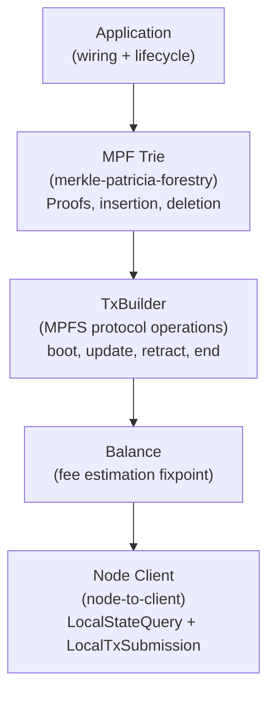
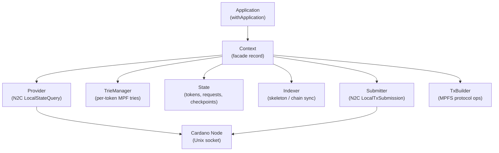
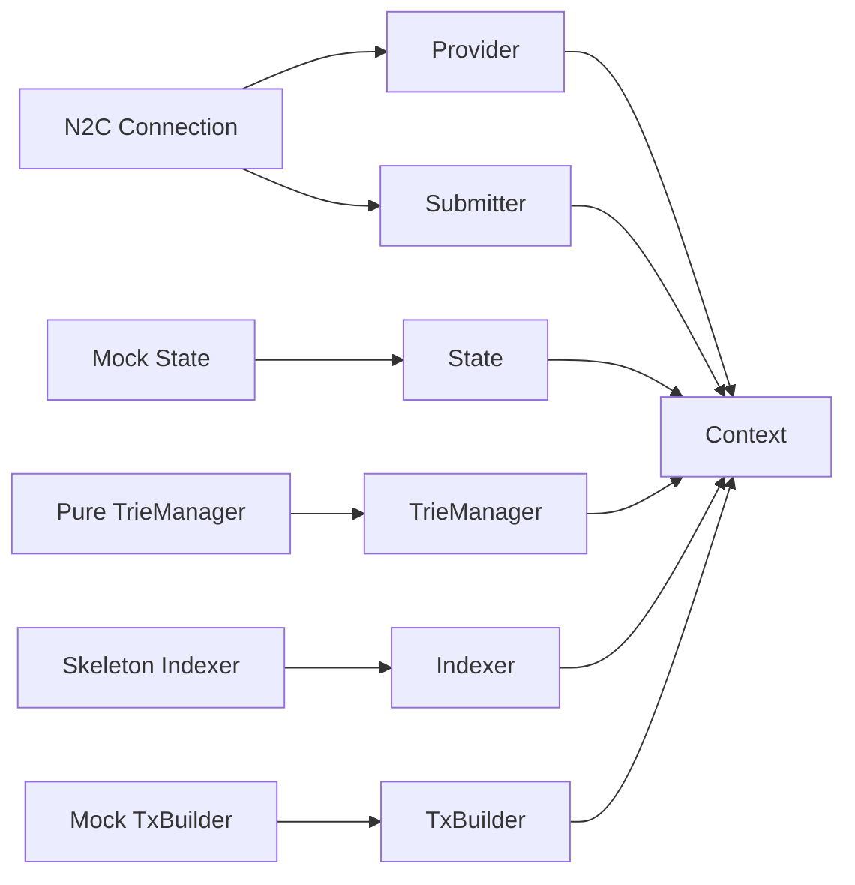
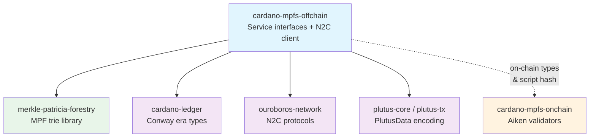
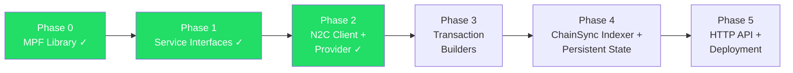

# Architecture Overview

## System Stack

The service connects to a Cardano node via a Unix socket carrying
multiplexed N2C mini-protocols. The `Provider` queries UTxOs and
protocol parameters via `LocalStateQuery`; the `Submitter` sends
signed transactions via `LocalTxSubmission`. The `TxBuilder`
constructs MPFS protocol transactions (boot, update, retract, end)
and `balanceTx` handles fee estimation through a fixpoint loop.

## Singleton Dependency Graph

Every major component is a **record of functions** (no typeclasses).
Records are created bottom-up and torn down top-down using bracket
patterns.

## Application Wiring

`withApplication` creates and wires all components:

The `Provider` and `Submitter` use real N2C connections. State,
TrieManager, and Indexer currently use mock/pure/skeleton
implementations.

## External Dependencies

| Color | Meaning |
|-------|---------|
| Blue | This project |
| Green | MPF trie library (same repo) |
| Orange | On-chain Aiken validators (separate repo) |
| Purple | Cardano ecosystem dependencies |

## Design Principles

- **No typeclasses** — closed world with explicit records of functions.
- **All types from cardano-ledger** — `Tx ConwayEra`, `PParams ConwayEra`, `Addr`, `TxIn`, etc.
- **Visible dependency graph** — no implicit resolution surprises.
- **Trivial testing** — swap the record for a mock backend.
- **No orphan instances**.

## Implementation Phases

| Phase | Description | Status |
|-------|-------------|--------|
| 0 | MPF library — 16-ary Merkle Patricia Forestry, Blake2b-256 hashing, insertion/deletion/proofs, pure and RocksDB backends | Done |
| 1 | Service interfaces — `Provider`, `Submitter`, `TxBuilder`, `State`, `Indexer`, `TrieManager`, `Context` records; mock implementations; `balanceTx` with fixpoint fee estimation; on-chain type encodings; CIP-57 blueprint validation; Aiken-compatible proof serialization | Done |
| 2 | N2C client + Provider — `ouroboros-network` LocalStateQuery and LocalTxSubmission clients; `mkNodeClientProvider` for UTxO and PParams queries; `mkN2CSubmitter` for transaction submission; E2E tests with cardano-node subprocess | Done |
| 3 | Transaction builders — real `TxBuilder` implementations for boot, update, retract, end operations with Plutus script witnesses, proof embedding, and on-chain datum construction | Planned |
| 4 | ChainSync indexer + persistent state — replace skeleton indexer with real ChainSync follower; RocksDB-backed State and TrieManager; block processing with rollback support | Planned |
| 5 | HTTP API + deployment — Servant HTTP layer, Docker via Nix, deploy to plutimus.com | Planned |
