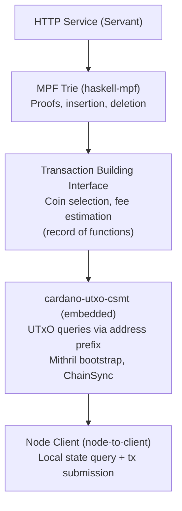
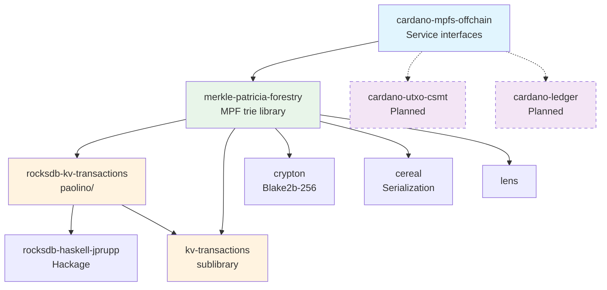

# Architecture Overview

## System Stack

The system is a vertical stack. The HTTP layer receives oracle
requests, delegates to the MPF trie logic, which in turn uses
the transaction builder to construct Cardano transactions.
The transaction builder relies on the UTxO index (provided by
`cardano-utxo-csmt`) and the node client for protocol parameters,
transaction evaluation, and submission.

## Singleton Dependency Graph

Every major component is a **record of functions** (no typeclasses).
Records are created bottom-up and torn down top-down using bracket
patterns.

## Creation Order

Each layer uses a `withX` bracket for resource cleanup guarantees.

## External Dependencies

| Color | Meaning |
|-------|---------|
| Blue | Offchain service (interfaces only) |
| Green | Merkle Patricia Forestry trie library |
| Orange | Custom repos (paolino/) |
| Purple dashed | Planned, not yet wired |
| White | Hackage dependencies |

## Design Principles

- **No typeclasses** — closed world with explicit records of functions.
- **Monad polymorphism** — all interfaces are polymorphic in `m`.
- **Visible dependency graph** — no implicit resolution surprises.
- **Trivial testing** — swap the record for a mock backend.
- **No orphan instances**.

## Implementation Phases

| Phase | Description | Status |
|-------|-------------|--------|
| 0 | MPF library — 16-ary Merkle Patricia Forestry, Blake2b-256 hashing, insertion/deletion/proofs, pure and RocksDB backends | Done |
| 1 | Transaction building interface — `TxBuilder` record, domain types, mock backend | Planned |
| 2 | UTxO index + node client — embed `cardano-utxo-csmt`, address-prefixed keys, LocalStateQuery, LocalTxSubmission | Planned |
| 3 | Transaction builders — boot, update, retract, end transactions with balancing and signing | Planned |
| 4 | Service — HTTP API, indexer, RocksDB-backed state, submitter | Planned |
| 5 | Deployment — Docker via Nix, deploy to plutimus.com | Planned |
