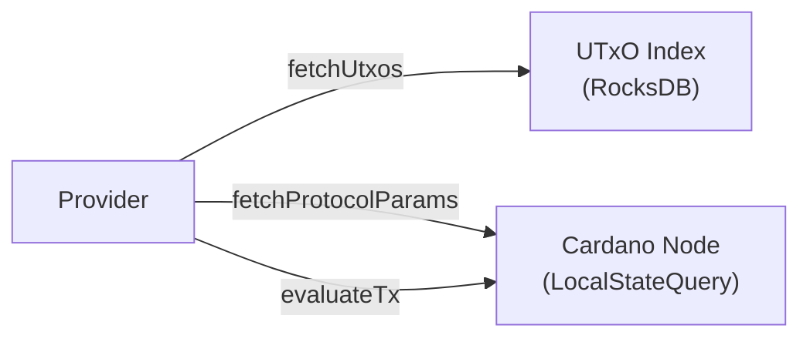
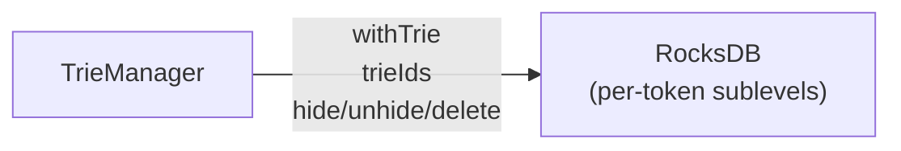
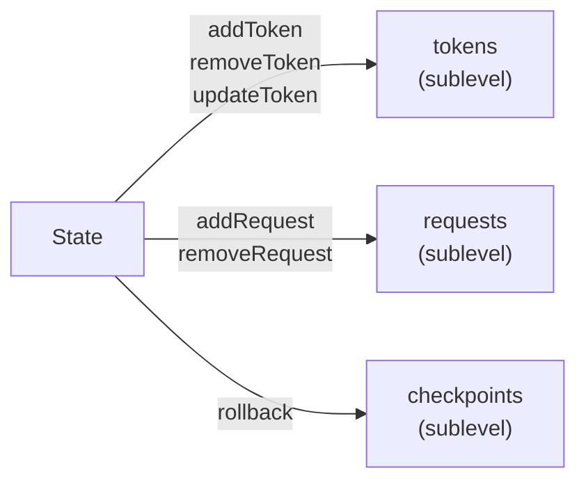
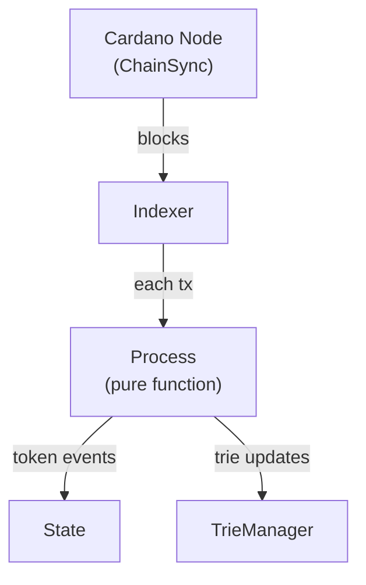
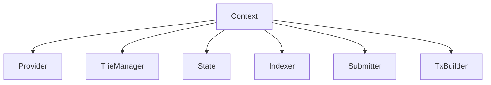

# Singletons

Every major component is a **record of functions**, polymorphic in
the monad `m`. No typeclasses are used — dependencies are explicit
and passed as values. This makes testing trivial: swap a record for
a mock.

## Provider

Blockchain queries (read-only). Wraps UTxO lookups from the CSMT
index and node state queries.

**Reads from:** UTxO index (RocksDB), Cardano Node (LocalStateQuery)

```haskell
data Provider m = Provider
    { fetchUtxos :: Address -> m [UTxO]
    -- ^ CSMT prefix scan over address-keyed UTxOs
    , fetchProtocolParams :: m ProtocolParams
    -- ^ Node local-state-query, cached per epoch
    , evaluateTx :: TxCBOR -> m ExUnits
    -- ^ Node local-state-query for Plutus execution units
    }
```



---

## TrieManager

Manages a map of token identifiers to MPF tries. Each token has
its own trie stored in a RocksDB sublevel. Access is mutex-locked.

**Reads from / writes to:** Trie storage (RocksDB sublevels)

```haskell
data TrieManager m = TrieManager
    { withTrie :: TokenId -> (SafeTrie m -> m a) -> m a
    -- ^ Mutex-locked access to a token's trie
    , trieIds :: m [TokenId]
    -- ^ List all known token tries
    , hide :: TokenId -> m ()
    -- ^ Mark a trie as hidden (for rollback)
    , unhide :: TokenId -> m ()
    -- ^ Restore a hidden trie
    , delete :: TokenId -> m ()
    -- ^ Permanently remove a trie
    }
```



---

## State

Chain-derived state tracking: known tokens, pending requests,
and checkpoints for rollback support. All stored in RocksDB
sublevels, mutex-locked.

**Reads from / writes to:** State tables (RocksDB sublevels)

```haskell
data State m = State
    { addToken :: Slotted Token -> m ()
    , removeToken :: Slotted TokenId -> m ()
    , updateToken :: Slotted TokenChange -> m ()
    , addRequest :: Slotted Request -> m ()
    , removeRequest :: Slotted OutputRef -> m ()
    , rollback :: WithOrigin Slot -> m ()
    -- ^ Rewind to a previous slot
    , tokens :: Tokens m
    -- ^ Sub-record for token queries
    , requests :: Requests m
    -- ^ Sub-record for request queries
    , checkpoints :: Checkpoints m
    -- ^ Sub-record for checkpoint queries
    }
```



---

## Indexer

ChainSync follower. Processes each block's transactions through
a pure `Process` function, updating State and TrieManager
accordingly. Pausable via mutex — paused during transaction
building to prevent state races.

**Reads from:** Cardano Node (ChainSync)
**Writes to:** State, TrieManager

```haskell
data Indexer m = Indexer
    { tips :: m (NetworkTip, IndexerTip)
    -- ^ Current network tip and indexer position
    , waitBlocks :: Int -> m BlockHeight
    -- ^ Wait for N new blocks (settlement)
    , pause :: m (m ())
    -- ^ Pause indexing, returns a release action
    }
```



---

## Submitter

Transaction submission via the node's LocalTxSubmission
mini-protocol. Shares the same socket as ChainSync.

**Writes to:** Cardano Node (mempool)

```haskell
data Submitter m = Submitter
    { submitTx :: TxCBOR -> m TxHash
    -- ^ Submit signed CBOR, returns transaction hash
    }
```

---

## TxBuilder

Pluggable transaction building interface. The backend
implementation is deferred — it could be extracted from
`cardano-wallet` or written as a lightweight custom solution.

**Reads from:** Provider (UTxOs, protocol params, evaluation)

```haskell
data TxBuilder m = TxBuilder
    { balanceTx :: PartialTx -> UTxOSet -> ProtocolParams -> m BalancedTx
    -- ^ Balance a partial transaction (coin selection + fee estimation)
    , estimateFee :: TxBody -> ProtocolParams -> m Coin
    -- ^ Estimate fees for a transaction body
    , selectCoins :: CoinSelectionGoal -> UTxOSet -> m CoinSelection
    -- ^ Select inputs to cover a given goal
    }
```

---

## Context

Facade record that bundles all singletons into a single
environment, threaded through transaction builders and HTTP
handlers.

```haskell
data Context m = Context
    { cagingScript :: CagingScript
    , signingWallet :: Maybe (SigningWallet m)
    , addressWallet :: Address -> m WalletInfo
    , newTxBuilder :: m (TxBuilder m)
    , fetchTokens :: m [Token]
    , fetchToken :: TokenId -> m (Maybe Token)
    , fetchRequests :: Maybe TokenId -> m [Request]
    , evaluateTx :: TxCBOR -> m ExUnits
    , withTrie :: TokenId -> (SafeTrie m -> m a) -> m a
    , waitBlocks :: Int -> m BlockHeight
    , tips :: m (NetworkTip, IndexerTip)
    , waitSettlement :: TxHash -> m BlockHash
    , facts :: TokenId -> m (Map Key Value)
    , pauseIndexer :: m (m ())
    , submitTx :: TxCBOR -> m TxHash
    }
```


