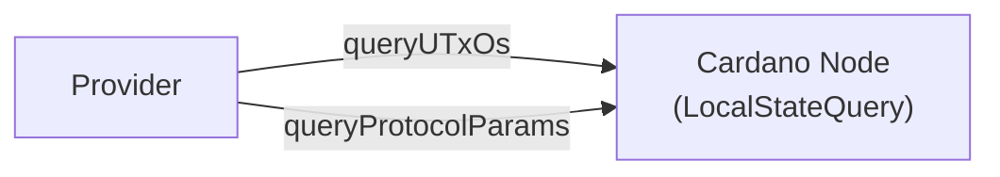
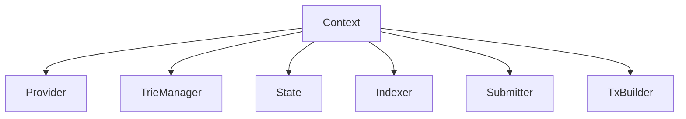

# Singletons

Every major component is a **record of functions**, polymorphic in
the monad `m`. No typeclasses are used — dependencies are explicit
and passed as values. This makes testing trivial: swap a record for
a mock.

## Provider

Blockchain queries (read-only). Queries a Cardano node via N2C
LocalStateQuery.

**Implementation:** `mkNodeClientProvider` (real N2C)

```haskell
data Provider m = Provider
    { queryUTxOs
        :: Addr
        -> m [(TxIn, TxOut ConwayEra)]
    -- ^ Look up UTxOs at an address
    , queryProtocolParams
        :: m (PParams ConwayEra)
    -- ^ Fetch current protocol parameters
    , evaluateTx
        :: ByteString -> m ExUnits
    -- ^ Evaluate execution units for a serialised
    -- CBOR transaction (not yet implemented)
    }
```



---

## TrieManager

Manages a map of token identifiers to MPF tries. Each token has
its own isolated trie.

**Implementation:** `mkPureTrieManager` (in-memory `IORef` maps)

```haskell
data TrieManager m = TrieManager
    { withTrie
        :: forall a
         . TokenId
        -> (Trie m -> m a)
        -> m a
    -- ^ Run an action with access to a token's trie
    , createTrie :: TokenId -> m ()
    -- ^ Create a new empty trie for a token
    , deleteTrie :: TokenId -> m ()
    -- ^ Delete a token's trie
    }

data Trie m = Trie
    { insert
        :: ByteString -> ByteString -> m Root
    , delete :: ByteString -> m Root
    , lookup :: ByteString -> m (Maybe ByteString)
    , getRoot :: m Root
    , getProof :: ByteString -> m (Maybe Proof)
    }
```

---

## State

Token and request state tracking. Three sub-records for tokens,
requests, and chain sync checkpoints.

**Implementation:** `mkMockState` (in-memory `IORef` maps)

```haskell
data State m = State
    { tokens :: Tokens m
    , requests :: Requests m
    , checkpoints :: Checkpoints m
    }

data Tokens m = Tokens
    { getToken :: TokenId -> m (Maybe TokenState)
    , putToken :: TokenId -> TokenState -> m ()
    , removeToken :: TokenId -> m ()
    , listTokens :: m [TokenId]
    }

data Requests m = Requests
    { getRequest :: TxIn -> m (Maybe Request)
    , putRequest :: TxIn -> Request -> m ()
    , removeRequest :: TxIn -> m ()
    , requestsByToken :: TokenId -> m [Request]
    }

data Checkpoints m = Checkpoints
    { getCheckpoint :: m (Maybe (SlotNo, BlockId))
    , putCheckpoint :: SlotNo -> BlockId -> m ()
    }
```

---

## Indexer

Chain sync follower with lifecycle control. Currently a skeleton
that returns a genesis tip.

**Implementation:** `mkSkeletonIndexer` (no-op, returns `SlotNo 0`)

```haskell
data ChainTip = ChainTip
    { tipSlot :: SlotNo
    , tipBlockId :: BlockId
    }

data Indexer m = Indexer
    { start :: m ()
    , stop :: m ()
    , pause :: m ()
    , resume :: m ()
    , getTip :: m ChainTip
    }
```

---

## Submitter

Transaction submission via N2C LocalTxSubmission. Takes a full
ledger `Tx ConwayEra` and returns a `SubmitResult`.

**Implementation:** `mkN2CSubmitter` (real N2C)

```haskell
data SubmitResult
    = Submitted TxId
    | Rejected ByteString

newtype Submitter m = Submitter
    { submitTx :: Tx ConwayEra -> m SubmitResult
    }
```

---

## TxBuilder

Constructs transactions for all MPFS protocol operations. Returns
full ledger `Tx` values ready for signing.

**Implementation:** `mkMockTxBuilder` (placeholder)

```haskell
data TxBuilder m = TxBuilder
    { bootToken
        :: Addr -> m (Tx ConwayEra)
    -- ^ Create a new MPFS token
    , requestInsert
        :: TokenId -> ByteString -> ByteString
        -> Addr -> m (Tx ConwayEra)
    -- ^ Request inserting a key-value pair
    , requestDelete
        :: TokenId -> ByteString
        -> Addr -> m (Tx ConwayEra)
    -- ^ Request deleting a key
    , updateToken
        :: TokenId -> Addr -> m (Tx ConwayEra)
    -- ^ Process pending requests for a token
    , retractRequest
        :: TxIn -> Addr -> m (Tx ConwayEra)
    -- ^ Cancel a pending request
    , endToken
        :: TokenId -> Addr -> m (Tx ConwayEra)
    -- ^ Retire an MPFS token
    }
```

---

## Balance

Pure transaction balancing function (not a singleton record).
Adds a fee-paying UTxO and change output, finding the fee via
a fixpoint loop over `estimateMinFeeTx`.

```haskell
balanceTx
    :: PParams ConwayEra
    -> (TxIn, TxOut ConwayEra)   -- fee-paying UTxO
    -> Addr                       -- change address
    -> Tx ConwayEra               -- unbalanced tx
    -> Either BalanceError (Tx ConwayEra)
```

The fee estimation iterates until stable (max 10 rounds, crashes
if not converged). One key witness is assumed for the fee input.

---

## Context

Facade record that bundles all singletons into a single environment.

```haskell
data Context m = Context
    { provider :: Provider m
    , trieManager :: TrieManager m
    , state :: State m
    , indexer :: Indexer m
    , submitter :: Submitter m
    , txBuilder :: TxBuilder m
    }
```


